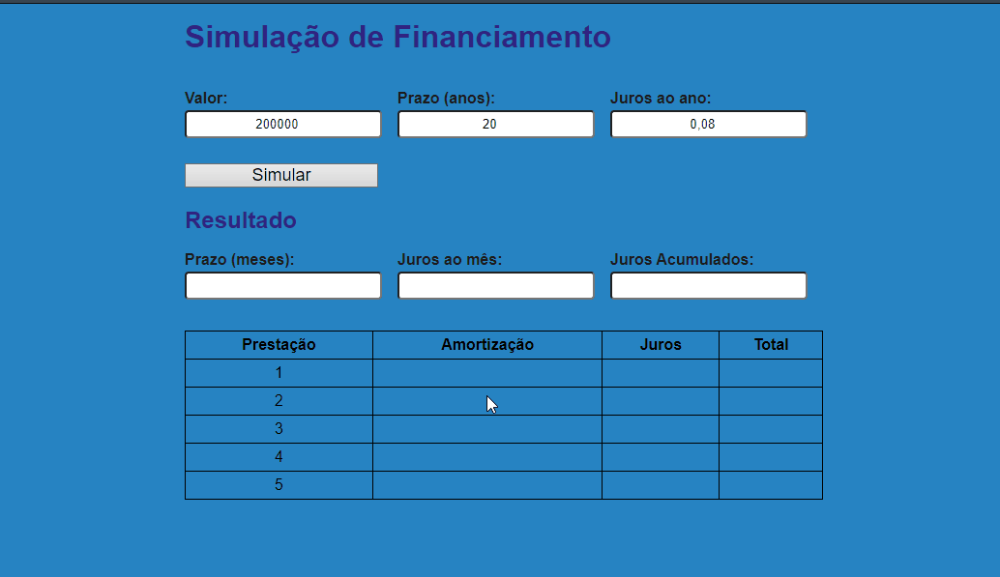

# Simulador de Financiamento

## Um trabalho proposto pelo Bootcamp da IGTI, o Tech Pan. O intuito deste programa é simular o valor de um financiamento. Com juros, amortização, valores da prestação. Pretendo ainda melhorar este projeto no futuro.

### Uma breve demonstração do que foi feito até agora:

### No futuro:

- [] Adicionar mais prestações.
- [] Melhorar esse botão.
- [] Tornar o HTML menor, utilizando o DOM para criar as tabelas.
- [] Inserir um layout.

### Tecnologias

No momento, as seguintes ferramentas foram utilizadas no projeto:

- HTML5
- CSS3
- JavaScript

Pretendo otimizar no futuro utilizando:

- React
- Node.js
